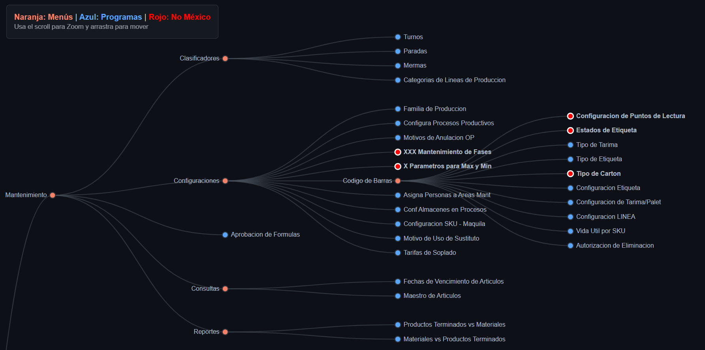

# Analisis del BM-CTL-Produccion_Mexico.xlsx y Produccion_arbol_funciones.html

## Jerarquia de menus
Un menu no es mas que una direccion postal. No contiene datos, solo sirve para clasificar y agrupas
1. Menu raiz(el modulo): Es el contenedor* mas grande (ej Mantenimiento) .En odoo , esto suele aparecer como un icono en el tablero principal-
2. Sub-Menu (categoria): Agrupa funciones similares(Clasificadores o configuraciones).Su funcion es puramente organizativa para que el usuario no vea 50 opciones de golpe, por ejemplo
3. Menu de accion (el acceso): Es el nivel más bajo (el circulo azul ej Turnos)

## los programas(la unidad funcional)
En el sistema antiguo, un programa es una pieza de codigo cerrada.En odoo , un "programa" se traduce tecnicamente en una **accion de ventana**(ir.actions.act_window)<br>

Un programa tiene :
1. EL modelo (la tabla): Si el programa es **Turnos**, el modelo es la tabla en PostgreSQL que guarda el nombre del turno, hora de inicio y fin.
2. La vista(La intefaz): Es el diseño de la pantalla(formulario para editar, lista para ver todos)
3. La logica (python/triggers): Es lo que ocurre cuando se guarda.Aqui nos conectamos con AJE.Por ejemplo , si un programa de "produccion" registra una cantidad, la logica dispara el Recalculo Total que se trabaja en la base datos.
## Analisis del arbol: El semaforo de mexico
1. Circulo Azul solido: Programa operativo y necesario.Requiere un archivo xml con su **menuitem** , su **action** y su modelo de base de datos asociado.
2. Circulo con borde rojo: Son las ramas muertas
    - Tipo de carton o parametro para Max y Min
    - Se tachan porque en mexico ya tiene otra forma de resolverlo o porque la funcionalidad sera absorbido por un proceso estandar de Odoo.
Ejemplo
```bash
+-----------------------+--------------------------+------------------------------+

| Concepto en el Árbol  | Tipo de Objeto en Odoo   | Archivo sugerido en VS Code  |
+-----------------------+--------------------------+------------------------------+

| Mantenimiento         | menuitem (Raíz)          | principal_menu.xml           |
| Clasificadores        | menuitem (Padre)         | mantenimiento_menu.xml       |
| Turnos                | menuitem + act_window    | mantenimiento_menu.xml       |
+-----------------------+--------------------------+------------------------------+

```
## Modulos funcionales
Se ven modulos funcionales , en odoo seran los menus que organizan el trabajo de la planta.
 
### Mantenimiento 
Es el mantenimiento de los datos maestros.Aqui se crean los turnos , se configuran las lineas de produccion y las etiquetas.
- Qué hace : Aqui se definen los parametros base: los turnos de trabajo, las lineas de produccion (llenadoras , etiquetadoras) los motivos de por que se detiene una máquina y como deben ser las etiquetas.
- En mexico : Es vital , se usa para configurar todo el entorno antes de empezar a fabricar 
<p align="center">
    
</p>

1. Nivel 1: Menu Raiz (El modulo)
    - Nombre: Mantenimiento
    - Archivo: principal_menu.xml
    - Funcion: Es el punto de entrada desde el tablero de Odoo
2. Nivel 2: Los pilares organizativos
    Aqui es donde se divide el trabajo
        - Clasificadores: Para datos maestros binarios (turnos , paradas)
        - Configuraciones: Para reglas de negocio complejos.
        - Consulta: Para visualizacion de datos
        - Reportes: Para salidas de informacion y KPIs
3.  Nivel 3: Agrupadores Especificas
    Dentro de configuraciones , existe un nivel intermedio
        - Codigo de barras: Este es el "padre" de todas las funciones de etiquetado
            - Programas (SI) : Tipo de tarima , Tipo de Etiqueta, Configuracion Etiqueta, Configuracion de Tarima /Palet, configuracion LINEA, Vida Util por SKU, Autorizacion de Eliminacion.
4.  Nivel 4: El programa (accion final)
    Aqui el usuario hace clic para trabajar(circulo azul)
    - Ejemplo: En el codigo de barras tenemos Tipo de Tarima  o configuracion Etiqueta.

si estuvieramos viendo la ruta "migas de pan" (breadcrumbs) en odoo para configurar una etiqueta en Mexico, se veria del siguiente modo(ej):

```bash
    mantenimiento → configuracion → codigo de barras → Configuracion Etiqueta
```
En los xmls se debe asegurar qu los **parent** coincidan
- En **mantenimiento_menu.xml**
    - El menu Configuracion debe tener **parent** a Mantenimiento
    - El menu codigo de barras deber tener como **parent** a configuraciones
    - El menu Tipo de Tarima debe tener como **parent** a codigo de barras

Entonces tenemos a **principal_menu.xml** es el archivo que contiene el Boton de Entrada para TODO el modulo de produccion de AJE.

- **principal_menu.xml** Nivel 1(Raiz) Menu principal "Produccion" o "Mantenimiento" (icono del tablero)
- **mantenimiento_menu.xml** Nivel 2 y 3  Menu "clasificadores" , "configuraciones" y sus hijos(turnos,paradas)
- **codigo_barras.xml** Nivel 3 y 4  El sub-menu "Codigo de barras" y sus programas (Tipos de tarima)
- **produccion_menu.xml** Nivel 2 y 3  Menu "operaciones" y sus hijos (Lanzar OP,Liquidar OP)
 
Los demas modulos siguen la misma logica

Por ejemplo para planeamiento, se tendra un **planeamiento_menu.xml**.Dentro de este, se creara el menu "Planeamiento" y se indicara que su **parent** es el ID que se define en el archivo principal.

### Planeamiento (Estrategia)

Se decide cuándo y cuánto fabricar
- Qué hace: Gestiona la capacidad de las lineas. Si mexico necesita producir 1 millon de litros de bebida , aqui se calcula si las lineas tiene capacidad fisica para hacerlo en el tiempo esperado.
- En Mexico: Se usa para mapear sucursales y lanzar ordenes de produccion desde el sistema de planificacion (AVAIL)
 

### Produccion (Ejecución)
Es el corazon operativa de la fabrica
- Que hace? : Aquí se pisa la planta.Se lanzan las ordenes de produccion (OP) ,se registra cuánta bebida se tiró(mermas) , cuántas horas trabajo el personal y se sacan los reportes diarios de eficiencia
- En Mexico: Es donde ocurre el mayor volumen de trasancciones diarias

### Control de Calidad (filtro)
Asegura que el producto sea seguro para el consumo
- Que hace?: Define los planes de inspeccion .Por ejemplo "cada 30 minutos hay que medir el nivel de gas de la bebida"
- En Mexico: Se usa principalmente para el Plan de inspeccion y aprobar si un lote sale a la venta o se queda en la cuarentena.

### Costos(El dinero)
Traduce lo anterior a terminos financieros
- Que hace?: Calcula el costo real de produccion.Suma el valor de los insumos (azucar , botellas), la mano de obra y los gastos indirectos (luz, agua) para decir cuanto costo cada unidad producida.

- En Mexico : muy importante para la simulacion de costos y control del "costo estandar"

### Utils / Utilidades (Las herramientas de auxilio)
Para corregir errores
- Que hace: Son funciones administrativas para ajustar el sistema cuando algo sale mal en el dia a dia.
- En Mexico: Se usa para cambiar "Cambiar de Fecha OP" y corregir "Movimiento de Almacen"
